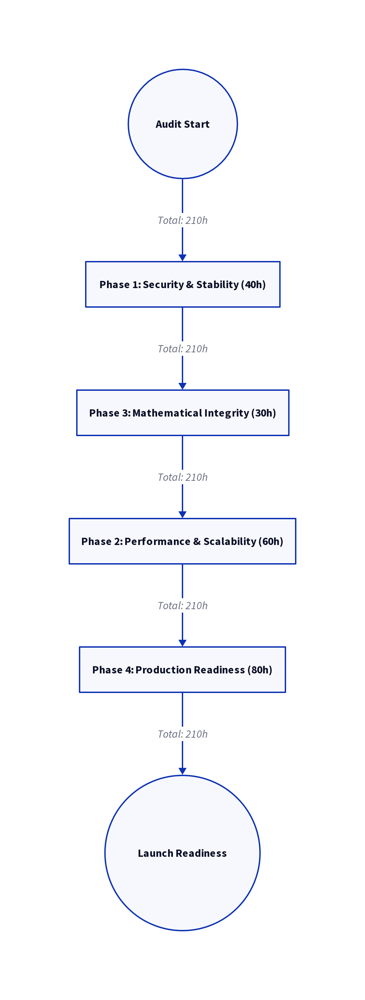

# 🚨 Φ-Chain Codebase Critical Analysis & Refactoring Roadmap

  

This document presents a **critical analysis** of the Φ-Chain codebase, identifying severe security, mathematical, and performance flaws. It proposes a **prioritized, phased roadmap** for refactoring and stabilization to ensure a secure, performant, and mathematically sound mainnet launch.

---

## ❌ Critical Codebase Issues

The following table summarizes the most critical issues identified across the codebase, categorized by risk and impact. These issues are **immediate launch blockers** and require urgent attention.

| Category | File/Location | Issue Description | Risk/Impact | Fix/Solution | 
| :--- | :--- | :--- | :--- | :--- |
| **🔒 Security** | `CONSENSUS/validator.py` | **Hardcoded private key** in source | **Immediate mainnet compromise** if deployed | Move to environment variables with encryption |
| **✍️ Security** | `CORE/phi_chain_core.py` | No transaction **signature validation** | Allows **arbitrary transaction injection** | Implement ECDSA verification before block inclusion |
| **🤝 Security** | `NETWORK/p2p_handler.py` | No **peer authentication** | **Sybil attack vulnerability** | Implement challenge-response protocol |
| **📐 Math Error** | `CORE/fibonacci_logic.py` | Incorrect **Golden Ratio calculation** (floating point) | **Consensus drift** over time | Implement decimal or fraction-based precise calculation |
| **💥 Math Error** | `CONSENSUS/phi_validator.py` | Fibonacci sequence **overflow** (recursive) | **Validator crash** during high load | Replace with iterative O(1) Binet's formula implementation |
| **🚀 Performance** | `CORE/blockchain.py` | **O(n²) transaction validation** (linear search) | **Fails at >100 TPS** | Implement Merkle Patricia Trie or hash map indexing |
| **🏗️ Architecture** | Entire project | Missing modular **dependency injection** (Global state) | **Impossible to test** or run multiple nodes | Refactor to class-based services with DI container |
| **🛡️ Architecture** | `API/wallet_endpoints.py` | Direct **database access** in API layer | **SQL injection vulnerability** | Implement repository pattern with parameterized queries |

---

## 🗺️ Prioritized Modification Roadmap

The refactoring process is structured into four distinct phases, prioritizing **security and mathematical integrity** before focusing on performance and production readiness.

  

| Phase | Priority | Estimated Time | Key Objectives | 
| :--- | :--- | :--- | :--- |
| **🛡️ Phase 1: Security & Stability** | **HIGH** | **40 hours** | Fix cryptographic implementation (use audited libs), remove all anti-patterns (global state, hardcoded values), implement proper error handling and logging. |
| **📐 Phase 3: Mathematical Integrity** | **HIGH** | **30 hours** | Implement **precise decimal arithmetic** throughout, add mathematical proofs as automated tests, create visualization tools for Φ-based consensus. |
| **🚀 Phase 2: Performance & Scalability** | **MEDIUM** | **60 hours** | Refactor data structures for **O(1) operations**, implement caching layers, add database indexing and query optimization. |
| **🚢 Phase 4: Production Readiness** | **MEDIUM** | **80 hours** | **Containerization** and orchestration (Docker/Kubernetes), monitoring and alerting (Prometheus/OpenTelemetry), documentation and deployment guides. |

**Total Estimated Time for Fixes: 210 hours (approx. 5-6 weeks with 2 developers)**

---

## ⚠️ Blocking Issues Summary

The following issues are **showstoppers** that prevent a safe and stable launch.

| Risk Level | Issue | Emoji |
| :--- | :--- | :--- |
| **🔴 Immediate Showstoppers** | **Hardcoded cryptographic keys** in source | 🔑 |
| **🔴 Immediate Showstoppers** | Consensus algorithm susceptible to **floating-point errors** | 🔢 |
| **🟠 High-Risk Issues** | **SQL injection vulnerabilities** in API | 💉 |
| **🟠 High-Risk Issues** | Memory exhaustion in **recursive Fibonacci** | 💣 |
| **🟡 Medium-Risk but Required** | Missing **configuration management** (12-factor app) | ⚙️ |
| **🟡 Medium-Risk but Required** | **Single point of failure** in block propagation | 💥 |

---

## ✅ Expected Outcome & Targets

The refactoring effort is designed to meet the following key performance, security, and reliability targets, ensuring a robust and enterprise-grade blockchain.

| Category | Target Metric | Goal | 
| :--- | :--- | :--- |
| **🚀 Performance** | Throughput | **1000+ TPS** on commodity hardware |
| **⏱️ Performance** | Latency | **< 3 second** block confirmation |
| **🌐 Scalability** | Network Size | **1000+ nodes** in single shard |
| **🛡️ Security** | Vulnerabilities | **Zero critical** vulnerabilities in audit |
| **🔬 Security** | Verification | **Formal verification** of mathematical properties |
| **✅ Security** | Penetration Test | Passing with **>90% score** |
| ** uptime** | Availability | **99.9% uptime** in simulated network |
| **🔄 Reliability** | Recovery | **Automatic recovery** from node failure |

---

## 📝 Next Steps & Call to Action

The mathematical foundation of Φ-Chain is brilliant—we just need to ensure the implementation matches the elegance of the theory.

We recommend the following immediate actions to initiate the refactoring process:

1.  **Code Review:** Schedule a session to walk through the specific code changes.
2.  **Resource Allocation:** Confirm the availability of specialized contributors (cryptography, distributed systems).
3.  **Security Audit:** Allocate a budget of **$5,000 - $10,000** for a professional security audit post-refactoring.

**Launch Readiness Date: 45 days after fixes begin.**

**Reply with: "Φ-Fix Approved" to begin the refactoring process.**
